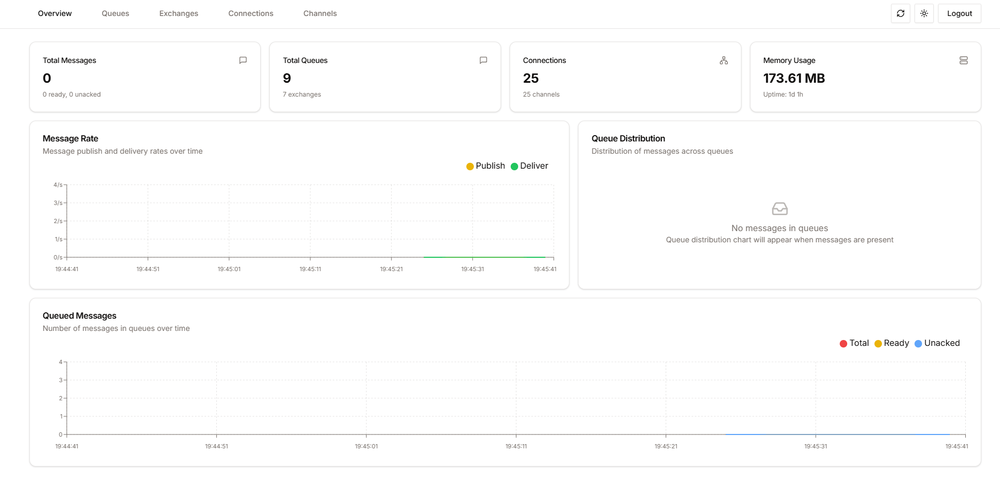
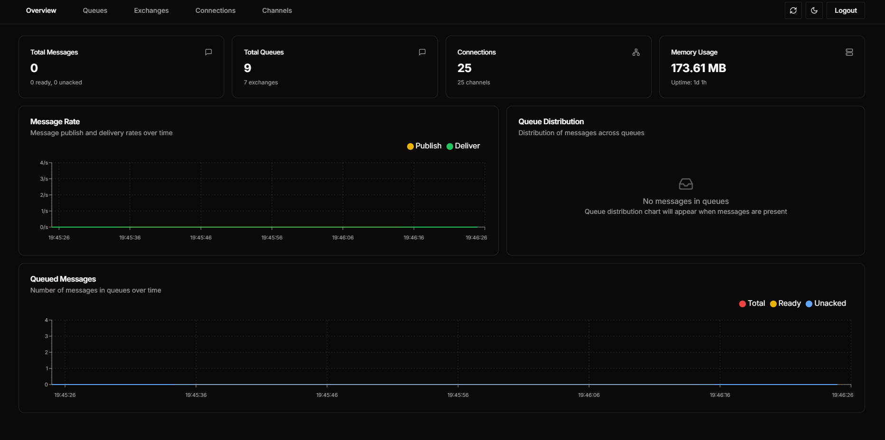

<div align="center">
  
  <h1>Rabbit<span style="color: #f97316">Scout</span></h1>
</div>

<p align="center">
Modern, intuitive dashboard for RabbitMQ management - A powerful alternative to the default RabbitMQ Management UI.
</p>

<p align="center">
  <a href="https://github.com/Ralve-org/RabbitScout/blob/main/LICENSE">
    
  </a>
  
  
  <a href="https://github.com/Ralve-org/RabbitScout/stargazers">
    
  </a>
  <a href="https://github.com/Ralve-org/RabbitScout/issues">
    
  </a>
</p>

<div align="center">
  <p>
    <a href="#-features">Features</a> •
    <a href="#-getting-started">Getting Started</a> •
    <a href="#%EF%B8%8F-tech-stack">Tech Stack</a> •
    <a href="#-screenshots">Screenshots</a> •
    <a href="#-contributing">Contributing</a> •
    <a href="#-license">License</a>
  </p>
</div>

## 🚀 Features

RabbitScout provides a comprehensive suite of features for managing your RabbitMQ instance:

### 📊 Analytics & Monitoring
- Real-time overview of system metrics
- Total message count monitoring
- Queue statistics and distribution
- Active connections tracking
- Memory usage visualization
- Live message rate graphs
- Queue-specific message rate tracking

### 💼 Current Features
- **Queue Management**
  - 📋 Detailed queue listings with search and filter
  - 🔍 Message inspection capabilities
  - ⚡ Real-time queue metrics
  - 🗑️ Queue operations (purge, delete)
  - 📥 Message publishing interface
  
- **Exchange & Binding Viewing**
  - 🔄 Exchange configuration viewing
  - 👁️ View-only binding information
  
- **Connection & Channel Monitoring**
  - 👥 View active connections
  - 📡 Basic channel status viewing
  - 📉 Connection metrics viewing

### 🚧 Features In Development
- **Binding Management**
  - Binding creation and modification
  - Advanced binding configuration
  
- **Connection & Channel Management**
  - Advanced connection controls
  - Channel management actions
  - Detailed channel metrics
  - Connection force-close capabilities

### 🛡️ Security Features
- 🔐 Secure authentication system
- 🍪 Cookie-based session management
- ⚙️ Environment variable configuration
- 🔒 Secure credential handling

### 💫 User Experience
- 🌓 Dark/Light mode support
- 📱 Responsive design for all devices
- ⚡ Real-time updates
- 🎨 Modern, clean interface

## 🚀 Getting Started

### System Requirements
- Node.js 18.17 or later
- RabbitMQ Server 3.x or later
- Modern web browser

### Prerequisites
Before you begin, ensure you have:
- 🔧 Access to a RabbitMQ instance
- 📝 RabbitMQ management credentials
- 💻 Node.js installed locally

### Installation

1. Clone the repository
   ```bash
   git clone https://github.com/Ralve-org/RabbitScout.git
   cd RabbitScout
   ```

2. Install dependencies
   ```bash
   npm install
   # or
   yarn install
   ```

3. Configure environment variables
   - Copy the example environment file
     ```bash
     cp .env.example .env
     ```
   - Update the .env file with your RabbitMQ credentials:
     ```env
     # Required Configuration
     NEXT_PUBLIC_RABBITMQ_HOST=your-rabbitmq-host    # RabbitMQ server hostname
     NEXT_PUBLIC_RABBITMQ_PORT=15672                 # RabbitMQ management port
     NEXT_PUBLIC_RABBITMQ_VHOST=/                    # Virtual host

     # Authentication
     RABBITMQ_USERNAME=your-username                 # RabbitMQ admin username
     RABBITMQ_PASSWORD=your-password                 # RabbitMQ admin password

     # Application Settings
     NEXT_PUBLIC_API_URL=http://localhost:3000       # Application URL
     ```

### Authentication

1. **Access the Login Page**
   - Navigate to `http://localhost:3000/login`
   - You'll be presented with a clean, modern login interface

2. **Enter Credentials**
   - Username: Your RabbitMQ username (default: guest)
   - Password: Your RabbitMQ password (default: guest)

3. **Important Notes**
   - Default credentials (guest/guest) only work for localhost
   - For remote servers, use your RabbitMQ server credentials
   - Ensure your RabbitMQ user has management permissions

4. **Session Management**
   - Login sessions are secured with HTTP-only cookies
   - Sessions expire after period of inactivity
   - Use the logout button to end your session manually

### Development

Run the development server:
```bash
npm run dev
# or
yarn dev
```

Access the dashboard at [http://localhost:3000](http://localhost:3000)

### Production Build

Build for production:
```bash
npm run build
# or
yarn build
```

Start the production server:
```bash
npm start
# or
yarn start
```

### 🐳 Docker Usage

You can run RabbitScout using Docker in two ways:

#### Using Docker Compose
```yaml
services:
  rabbitscout:
    image: ghcr.io/ralve-org/rabbitscout:latest
    ports:
      - "3000:3000"
    environment:
      - NEXT_PUBLIC_RABBITMQ_HOST=your-rabbitmq-host
      - NEXT_PUBLIC_RABBITMQ_PORT=15672
      - NEXT_PUBLIC_RABBITMQ_VHOST=/
      - RABBITMQ_USERNAME=your-username
      - RABBITMQ_PASSWORD=your-password
      - NEXT_PUBLIC_API_URL=http://localhost:3000
```

#### Using Docker CLI
```bash
docker run -p 3000:3000 \
  -e NEXT_PUBLIC_RABBITMQ_HOST=your-rabbitmq-host \
  -e NEXT_PUBLIC_RABBITMQ_PORT=15672 \
  -e NEXT_PUBLIC_RABBITMQ_VHOST=/ \
  -e RABBITMQ_USERNAME=your-username \
  -e RABBITMQ_PASSWORD=your-password \
  -e NEXT_PUBLIC_API_URL=http://localhost:3000 \
  ghcr.io/ralve-org/rabbitscout:latest
```

## 🛠️ Tech Stack

- **Framework**: [Next.js 14](https://nextjs.org/)
- **UI Components**: [shadcn/ui](https://ui.shadcn.com/)
- **Styling**: [Tailwind CSS](https://tailwindcss.com/)
- **Language**: [TypeScript](https://www.typescriptlang.org/)
- **State Management**: React Hooks
- **Data Fetching**: Next.js App Router & Server Components

## 📦 Project Structure
```
rabbitscout/
├── app/                          # Next.js app directory
│   ├── api/                      # API routes
│   │   ├── auth/                # Authentication endpoints
│   │   ├── queues/              # Queue management endpoints
│   │   └── stats/               # Statistics and metrics endpoints
│   ├── dashboard/               # Dashboard pages
│   │   ├── connections/         # Connection management
│   │   ├── exchanges/           # Exchange management
│   │   ├── queues/             # Queue management
│   │   └── page.tsx            # Main dashboard
│   └── login/                   # Authentication pages
├── components/                   # React components
│   ├── auth/                    # Authentication components
│   ├── dashboard/               # Dashboard components
│   │   ├── message-rate-chart   # Message rate visualization
│   │   ├── overview-stats       # System statistics
│   │   ├── queue-distribution   # Queue metrics
│   │   └── queued-messages      # Queue message charts
│   ├── ui/                      # Reusable UI components
│   └── shared/                  # Shared components
├── docs/                        # Documentation
│   └── assets/                  # Documentation assets
├── hooks/                       # Custom React hooks
│   ├── use-toast.ts            # Toast notifications
│   └── use-websocket.ts        # WebSocket connections
├── lib/                         # Utility functions
│   ├── api/                    # API client functions
│   ├── auth/                   # Authentication utilities
│   ├── constants/              # Constants and configs
│   ├── types/                  # TypeScript types
│   └── utils/                  # Helper functions
├── public/                      # Static assets
│   └── images/                 # Image assets
├── .env.example                 # Example environment variables
├── .eslintrc.json              # ESLint configuration
├── .gitignore                  # Git ignore rules
├── components.json             # UI components config
├── middleware.ts               # Next.js middleware
├── next.config.js             # Next.js configuration
├── package.json               # Project dependencies
├── postcss.config.mjs         # PostCSS configuration
├── tailwind.config.ts        # Tailwind CSS configuration
└── tsconfig.json             # TypeScript configuration
```

## 🎨 Screenshots

### Light Mode Dashboard


### Dark Mode Dashboard


These screenshots showcase the dashboard overview tab in both light and dark modes, featuring:
- Real-time message rate graphs
- Queue distribution charts
- System overview statistics
- Memory usage metrics

## 🔄 Updates & Roadmap

### Currently in Development
- 🔗 Complete binding management system
- 🎮 Advanced connection & channel controls
- 📊 Enhanced channel metrics
- 🔄 Connection management actions

### Coming Soon
- 📊 Enhanced visualization options
- 🔔 Real-time notifications
- 🔍 Advanced search capabilities
- 📈 Extended metrics and analytics

### Known Limitations
- Binding management functionality is currently disabled
- Channel and connection management actions are in development
- Some advanced features are view-only at this time

## 🤝 Contributing

We welcome contributions! Here's how you can help:

### Ways to Contribute
- 🐛 Report bugs and issues
- 💡 Suggest new features
- 📝 Improve documentation
- 🔧 Submit pull requests

### Development Process
1. Fork the repository
2. Create your feature branch (`git checkout -b feature/AmazingFeature`)
3. Commit your changes (`git commit -m 'Add some AmazingFeature'`)
4. Push to the branch (`git push origin feature/AmazingFeature`)
5. Open a Pull Request

## 📜 License

This project is licensed under the MIT License - see the [LICENSE](LICENSE) file for details.

## 🙏 Acknowledgments

- Built with [Next.js](https://nextjs.org/) 🚀
- UI components from [shadcn/ui](https://ui.shadcn.com/) 🎨
- Powered by [TypeScript](https://www.typescriptlang.org/) 💪
- Styled with [Tailwind CSS](https://tailwindcss.com/) 🎯

---

<div align="center">
  Made with ❤️ by the Ralve team
</div>